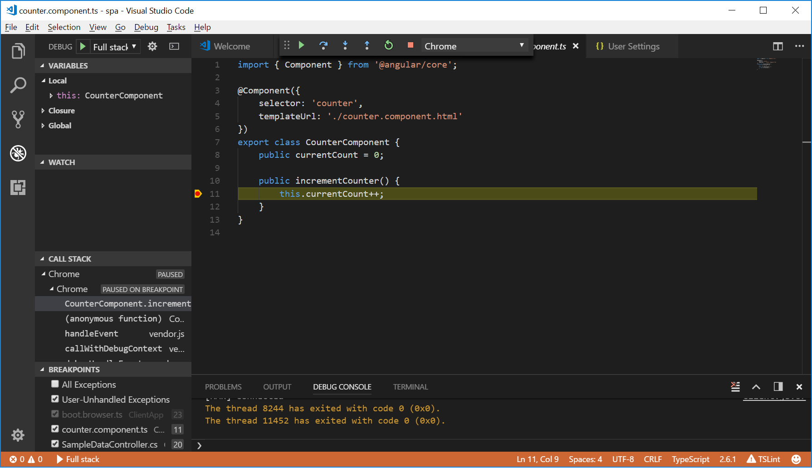
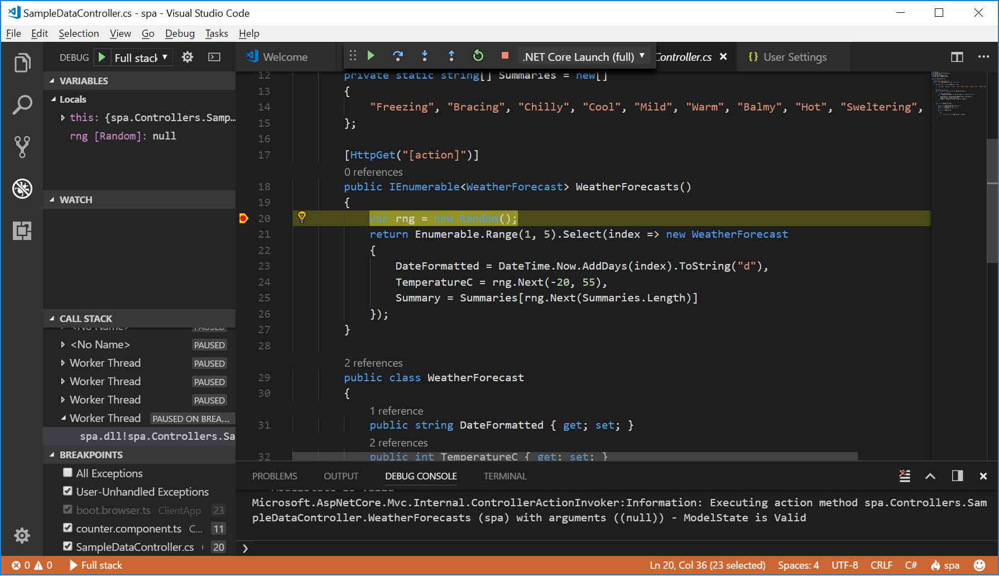

# Debugging both Typescript and C# with Angular AspNetCore.SpaTemplates

by [John Pankowicz](https://github.com/johnpankowicz)

This recipe shows how to use both the built-in JavaScript debugger and the
[C# for Visual Studio Code](https://github.com/OmniSharp/omnisharp-vscode)
extension together to debug a C#/Typescript application generated by the
[Angular AspNetCore.SpaTemplates](https://www.nuget.org/packages/Microsoft.AspNetCore.SpaTemplates/).

## Prerequisites to install

-   [Google Chrome](https://www.google.com/chrome) installed in its default
    location.

-   Version **1.13.1** of the
    [C# for Visual Studio Code](https://marketplace.visualstudio.com/items?itemName=ms-dotnettools.csharp)
    extension installed in VS Code.

-   .NET Core SDK 1.0 RC4 (or later) for Windows, Mac, or Linux

    ( See:
    [Building Single Page Applications on ASP.NET Core with JavaScriptServices](https://blogs.msdn.microsoft.com/webdev/2017/02/14/building-single-page-applications-on-asp-net-core-with-javascriptservices/)
    )

-   Node.js, version 6 or later

## Getting Started

-   To install the Single Page Application (SPA) templates, run the following
    command:

    ```
    dotnet new --install Microsoft.AspNetCore.SpaTemplates::*
    ```

-   Use SpaTemplates to create a new Angular application.

    ```
    mkdir my-app
    cd my-app
    dotnet new angular
    ```

-   Restore dependencies

    ```
    dotnet restore
    npm install
    ```

-   Open VS Code.

    ```
    code .
    ```

Vscode might ask: "Required assets to build and debug are missing from your
project. Add them?" If so, choose Yes. This will add a .vscode directory with a
launch.json and tasks.json file.

## Configure launch.json File

-   Click on the Debugging icon in the Activity Bar to bring up the Debug view.
    Then click on the gear icon to configure a launch.json file:

-   Add the following configurations to the "configurations" array:

    ```
    {
     "version": "0.2.0",
     "configurations": [
          {
              "name": ".NET Core Launch (full)",
              "type": "coreclr",
              "request": "launch",
              "preLaunchTask": "build",
              // If you have changed target frameworks, make sure to update the program path.
              "program": "${workspaceFolder}/bin/Debug/netcoreapp2.0/spa.dll",
              "args": [],
              "cwd": "${workspaceFolder}",
              "stopAtEntry": false,
              "internalConsoleOptions": "openOnSessionStart",
              "launchBrowser": {
                  "enabled": false
              },
              "env": {
                  "ASPNETCORE_ENVIRONMENT": "Development"
              },
              "sourceFileMap": {
                  "/Views": "${workspaceFolder}/Views"
              }
          },
          {
              "type": "chrome",
              "request": "launch",
              "name": "Chrome",
              "url": "http://localhost:5000",
              "webRoot": "${workspaceFolder}/wwwroot"
          }
      ],
      "compounds": [
          {
              "name": "Full stack",
              "configurations": [".NET Core Launch (full)", "Chrome"]
          }
      ]
    }
    ```

    ## Start Debugging

-   Set a Typescript breakpoint in
    **ClientApp\app\components\counter\counter.component.ts** on the line:

    ```
    this.currentCount++;
    ```

-   Set a C# breakpoint in **Controllers\SampleDataController.cs** on the line:

    ```
    var rng = new Random();
    ```

-   Go to to the Debug view, select the **'Full stack'** configuration, then
    press F5 or click the green arrow.

-   When a browser opens with the sample application, click "Counter" in the
    left navigation bar. Click "Increment". You should then hit the Typescript
    breakpoint:

    

-   Hit F5 or the green arrow in VSCode to continue execution.

-   Click "Fetch Data" in the left navigation bar. You should then hit the C#
    breakpoint.

    
