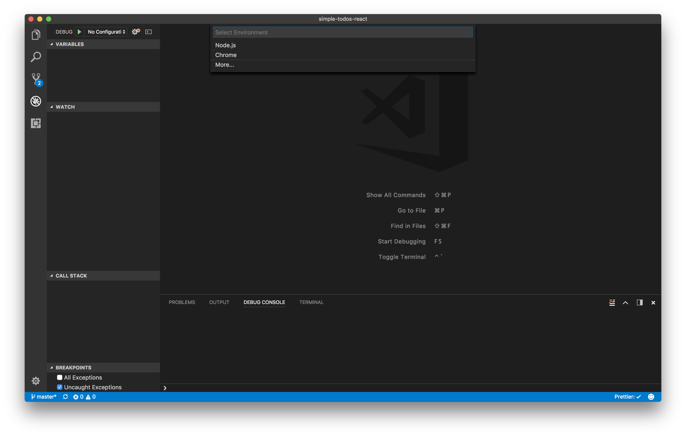
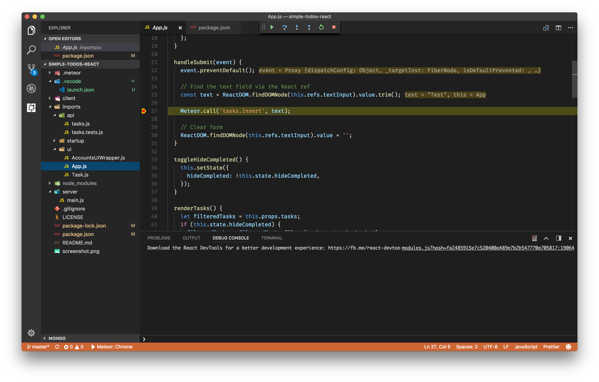

# Meteor debugging in VS Code (Node and Chrome)

by [Kenneth Auchenberg](https://twitter.com/auchenberg)

This recipe shows how to use the built-in JavaScript deubgger in VS Code to debug [meteor](https://www.meteor.com/) applications.

Meteor is used to write applications that run on both the server and client with the same code, and this is a great match for VS Code, as we can debug both the server and client at the same time! This means that you'll need to use two debugger instances within VS Code to debug both ends.

**Note:** Please make sure you are using **Meteor 1.6+ and Node.js 8.9+**, as our debuggers rely on the new Inspector protocol, which landed in [Meteor PR9201](https://github.com/meteor/meteor/pull/9201)

## Getting Started

1. Make sure to have the latest version of VS Code installed.

2. This guide assumes that you are using the official sample app [simple-todos-react](https://github.com/meteor/simple-todos-react). Clone the repo to get started:
    >
    ```
    git clone https://github.com/meteor/simple-todos-react
    cd simple-todos-react
    npm install
    code .
    ```

## Configure VS Code debugging with a launch.json file

- Click on the Debugging icon in the Activity Bar to bring up the Debug view.
Then click on the gear icon to configure a launch.json file, selecting **Chrome** for the environment:

   

- Replace content of the generated launch.json with the following two configurations:

```json
{
    "version": "0.2.0",
    "configurations": [
        {
            "type": "chrome",
            "request": "launch",
            "name": "Meteor: Chrome",
            "url": "http://localhost:3000",
            "webRoot": "${workspaceFolder}",
            "outputCapture": "std"
        },
        {
            "type": "node",
            "request": "launch",
            "name": "Meteor: Node",
            "runtimeExecutable": "npm",
            "runtimeArgs": ["start"],
            "outputCapture": "std",
        }
    ],
    "compounds": [
        {
            "name": "Meteor: All",
            "configurations": ["Meteor: Node", "Meteor: Chrome"]
        }
    ]
}

```

## Debugging the Meteor API Node process

  1. Go to the Debug view, select the **'Meteor: Node'** configuration, then press F5 or click the green play button.

  2. VS Code should now attempt to start your Meteor app.

  3. Go ahead and set a breakpoint in **imports/api/tasks.js** on `line 25` within the `tasks.insert` function.


  4. Open your favorite browser and go to `http://localhost:3000`.

  5. Your breakpoint should now be hit.

## Debugging the Meteor renderer Chrome process

  1. While your debug session is running you can go to the Debug view, select the **'Meteor: Chrome'** configuration, which will launch Google Chrome, and connect VS Code to the renderer process.

  3. When connected, go to `imports/ui/App.js` and set a breakpoint on `line 27` within the `handleSubmit` function.

  4. Now go to your Google Chrome window and click one of the images that opens in a modal.

  5. Your breakpoint in `imports/ui/App.js` on `line 27` should now be hit, and you can debug the logic.



## Debugging of both Node and Chrome at the same time

Now that you have learned to debug both the Main and the Renderer process you can take advantage of our [`compounds configurations`](https://code.visualstudio.com/updates/v1_8#_multitarget-debugging) that enables you to start multiple debugging sessions at the same time.

1. Go to the Debug view, select the **'Meteor: All'** configuration, which will connect VS Code to the both Main and Renderer process, and enable you to have a smooth development workflow.
2. Set breakpoints in any of the files like above.
3. Party 🎉🔥

## Debugging Meteor Tests

The principles are very similar to those outlined above. In your `package.json` you probably already have a line like this:

```json
    "test": "meteor test --driver-package=practicalmeteor:mocha --port 3010",
```

To enable debugging of these test scripts, you need to add two new launch configurations to your `launch.json` file - one for the server side tests, and the other for client side:

```json
    {
      "type": "node",
      "request": "launch",
      "name": "Meteor: Server Tests",
      "runtimeExecutable": "npm",
      "runtimeArgs": [
        "run",
        "test"
      ],
      "port": 9229,
    },
    {
      "type": "chrome",
      "request": "launch",
      "name": "Meteor: Client Tests",
      "url": "http://localhost:3010",
      "webRoot": "${workspaceFolder}"
    },
```

You can also add a new section in the `compounds` section of this file that will run both these tests together in a chrome browser:

```json
   {
      "name": "Meteor: All Tests",
      "configurations": [
        "Meteor: Server Tests",
        "Meteor: Client Tests"
      ]
    }
```

In the Debug view in VSCode, choose '**Meteor: All Tests**' and press F5. Chrome should open at `localhost:3010` - but there will be a connection refused error message displayed until the test server fires up and your tests run. Set break points (as explained above) and select the tests you wish to run in the browser.

You may see timeout failures since, while debugging, your tests will likely take more than the default mocha timeout period of 2 seconds to complete.
